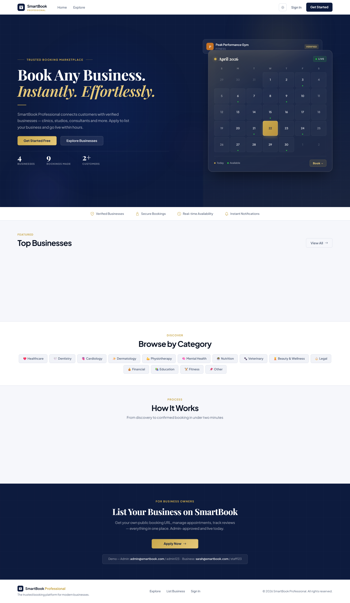
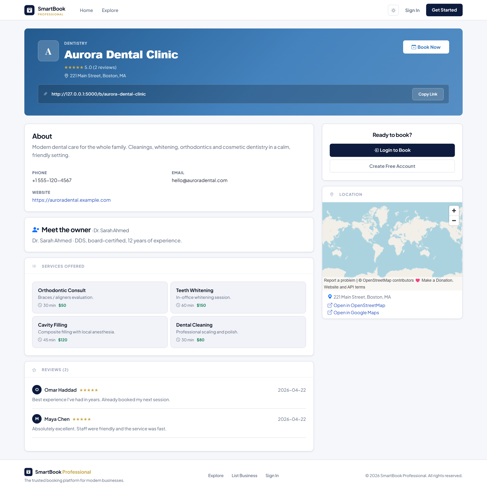
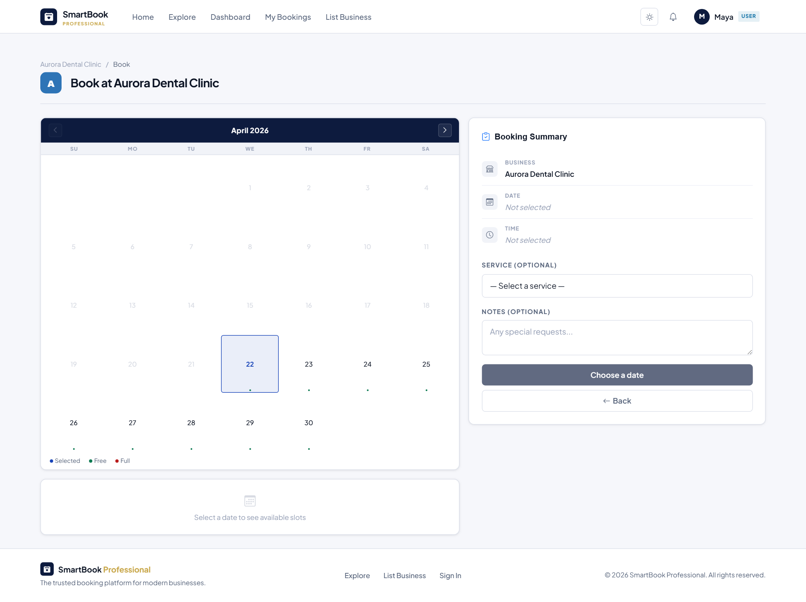
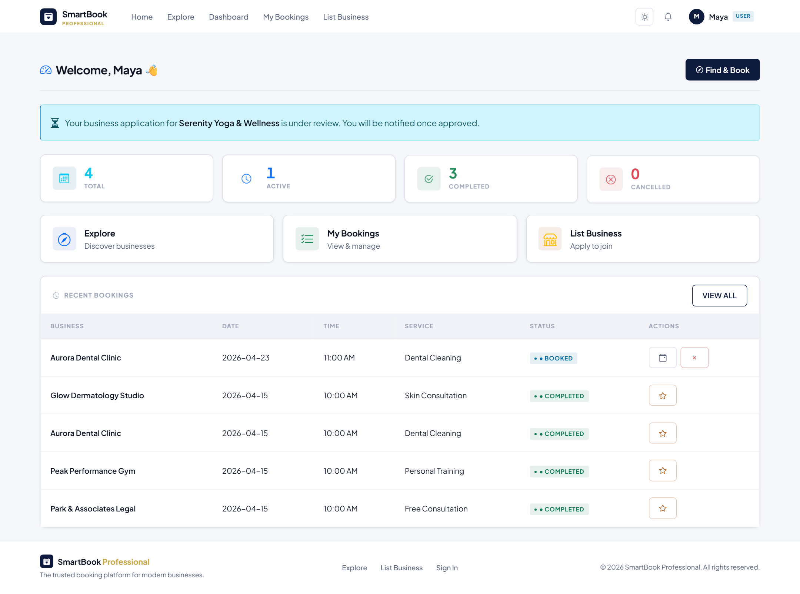
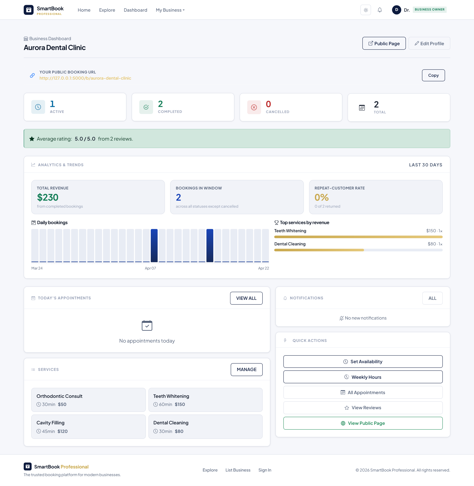
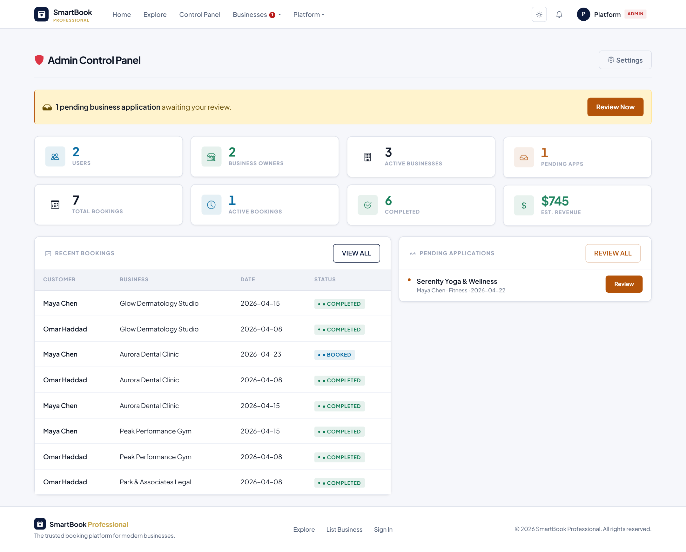
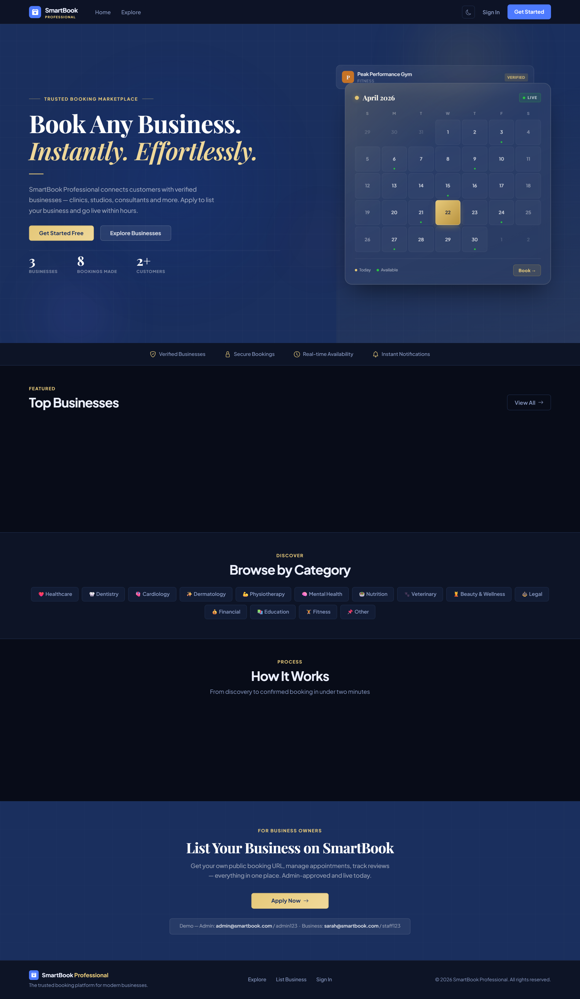
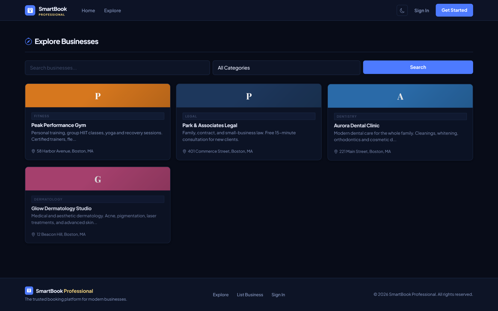
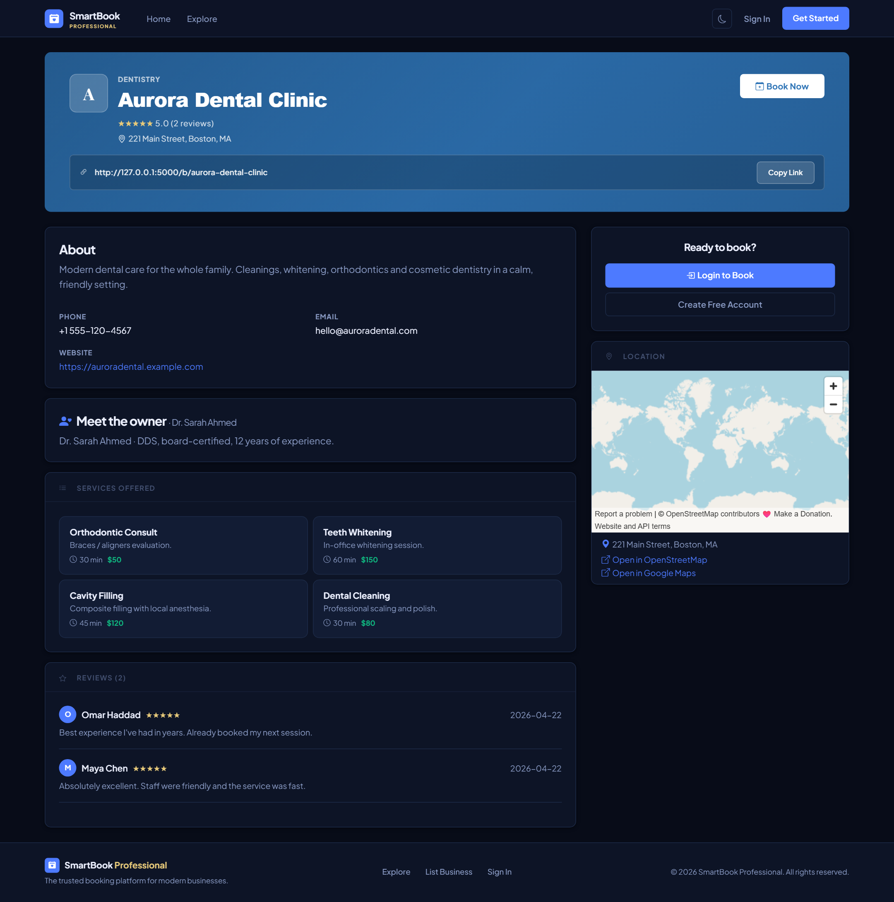

# Smart Appointment System

A multi-category appointment booking platform built with Flask, MySQL and
Bootstrap. Customers browse businesses, pick a time, and book online;
business owners manage their schedule from a dashboard; admins oversee the
whole platform.

## Team

- **Melad Mustafabadran** — Team Leader - Frontend
- **Beste Ozkan** — Designer - Frontend
- **Ahed Akrout** — Backend
- **Osamah Naji** — Tester


---

## Screenshots

| Public home | Business page | Booking calendar |
|---|---|---|
|  |  |  |

| Customer dashboard | Business-owner dashboard | Admin control panel |
|---|---|---|
|  |  |  |

| Dark-theme home | Dark-theme explore | Dark-theme business page |
|---|---|---|
|  |  |  |

All 26 screenshots can be regenerated with `py capture_screenshots.py` (Playwright, headless Chromium).

---


| Metric | Value |
|---|---|
| Python source files | 27 |
| Lines of Python code | ≈ 4000 |
| Lines of HTML / template | ≈ 2,280 |
| Registered URL routes | 48 |
| User roles | 3 (user · business_owner · admin) |

---

## Features

### Customers
- Browse and search the marketplace
- Open a business page with services, reviews, gallery, and weekly hours
- Book a specific service at a specific time
- Cancel, reschedule, and review completed appointments
- Personal dashboard with upcoming bookings and notifications

### Business owners
- Analytics dashboard (revenue, bookings, repeat-customer rate)
- Services CRUD (name, duration, price, description)
- Weekly working-hours editor
- Per-date availability overrides
- Appointment table with status updates
- Reply to customer reviews
- Full public-profile editor (logo, gallery, bio, category)

### Admins
- Control-panel dashboard with platform statistics
- Business-application inbox with approve / reject
- Business management (featured, suspend, delete)
- User management (edit, suspend, change role)
- Appointment override and review moderation
- Full audit log of every admin action
- Platform settings

### Cross-cutting
- Notifications inbox per user
- SMTP email (falls back to console)
- Dark-theme toggle persisted in the user session
- Per-IP login rate-limiting
- Flash-message feedback on every state-changing action

---


### Demo credentials

| Role | Email | Password |
|---|---|---|
| Customer | `maya@smartbook.com` | `maya123` |
| Business owner | `sarah@smartbook.com` | `staff123` |
| Platform admin | `admin@smartbook.com` | `admin123` |

---

## Tech stack

- **Language** — Python 3.10+ (tested on 3.13)
- **Framework** — Flask 3
- **Templates** — Jinja2 (auto-escaping by default)
- **Front-end** — Bootstrap 5 + Bootstrap Icons, vanilla JS
- **Storage** — Single JSON file through `db.load_db / db.save_db` (atomic write) — designed for painless migration to MySQL/PostgreSQL
- **Auth** — Flask sessions signed with `SECRET_KEY`; passwords hashed with PBKDF2-HMAC-SHA256 (Werkzeug)
- **Testing** — `requests` for HTTP e2e tests, `Playwright` for screenshots and UI automation
- **Docs** — `python-docx` generators produce all Word documents in this repo

---

## Repository layout

```
smartbook_web/
├── app.py                  # create_app + run
├── config.py               # SECRET_KEY, paths, constants
├── db.py                   # JSON-file persistence (atomic write)
├── helpers.py              # shared pure functions
├── decorators.py           # @login_required, @role_required
├── app_utils.py            # email, rate-limit, file upload, audit log
├── routes/                 # blueprints
│   ├── auth.py             # /login /register /logout /forgot
│   ├── public.py           # / /explore /b/<slug> /b/<slug>/book
│   ├── user.py             # /user/* /apply /notifications
│   ├── business.py         # /business/* owner back-office
│   └── admin.py            # /admin/* control panel
├── services/               # domain helpers (booking math, etc.)
├── templates/              # 33 Jinja2 templates
├── static/                 # Bootstrap, icons, CSS, uploads/
├── seed.py                 # bootstrap admin + staff users
├── seed_demo.py            # 4 demo businesses + services + reviews
├── test_all.py             # 70-check e2e HTTP test suite
├── capture_screenshots.py  # Playwright UI capture (26 PNGs)
├── build_docs.py           # generator: code-walkthrough DOCX
├── build_product_doc.py    # generator: Homework 1 DOCX
└── build_risk_and_testing_doc.py   # generator: Homework 2 DOCX
```

---

## Author

Built as part of the Software Project Management curriculum.
